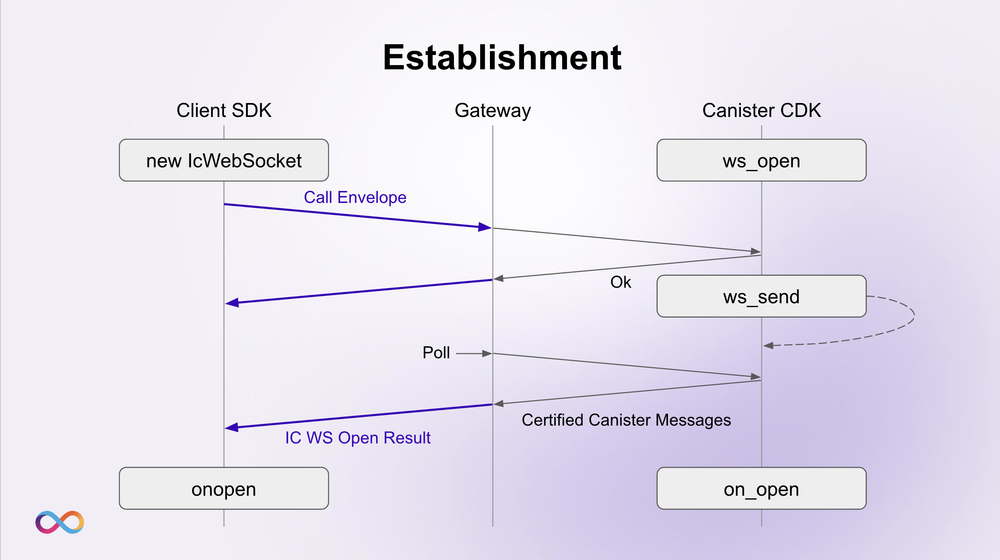
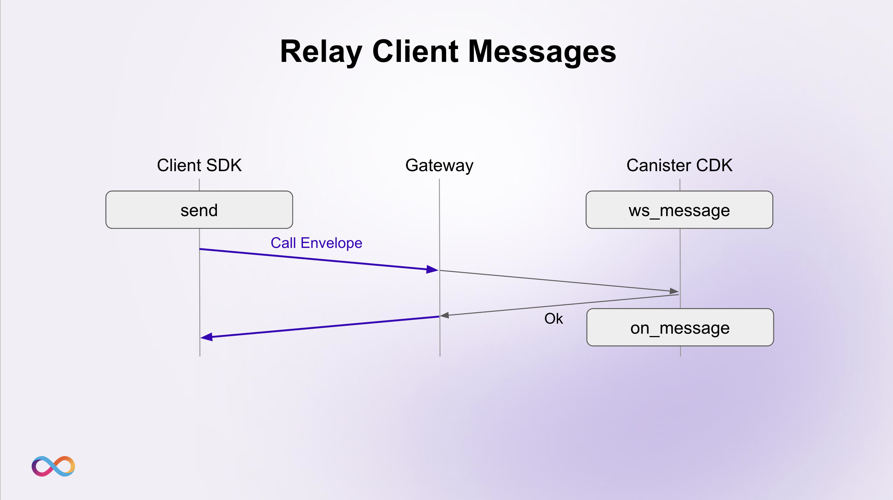
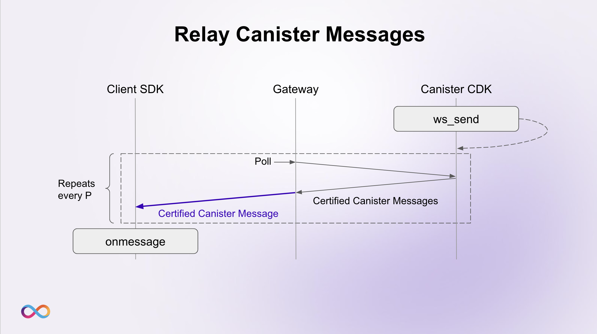
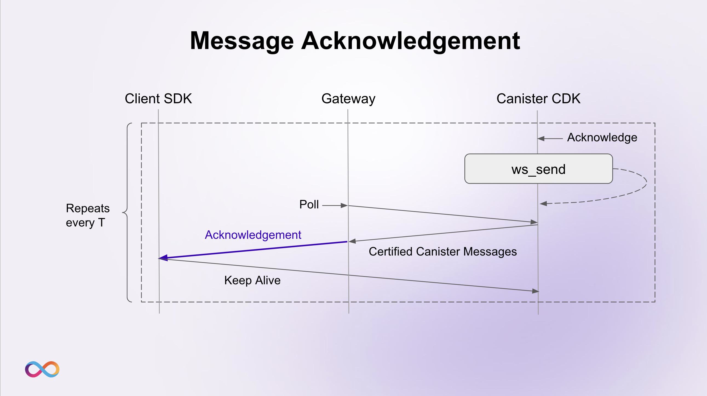

# Message Flow

## Establishment

To establish a new IC WebSocket connection, the client (via the [IC WebSocket Frontend SDK](https://github.com/omnia-network/ic-websocket-sdk-js)):

-   chooses a WS Gateway among the available ones and creates a new instance of `IcWebSocket` and passes the client’s identity to it (if any, otherwise a random one is generated by the SDK).
-   opens a WebSocket connection to the specified Gateway.
-   once the WebSocket connection is open, it creates a WebSocket Actor which is used to send requests, signed with the provided identity, to the Gateway. Each request specifies the canister and the method which the request is for.
-   the first request sent is a [signed envelope](https://internetcomputer.org/docs/current/references/ic-interface-spec#http-call) with content of `Call` variant. The content contains, among other things, the principal of the canister the client is connecting to, `ws_open` as the method name, and the argument of type `CanisterWsOpenArguments`.
-   sends the envelope to the WS Gateway.
-   once it receives the response containing the result of type `CanisterWsOpenResultValue`, triggers the `onWsOpen` callback.

The Gateway:

-   receives the envelope with content of variant `Call` from the client and relays it to the `canister/<canister_id>/call` endpoint of the Internet Computer.
-   receives the HTTP response from the IC containing `Ok(())` in the body and relays it to the client. This response is not enough for the client to trigger `onWsOpen`.
-   creates a mapping between the `client_id` assigned to the WebSocket connection and the client’s key composed of a principal (either corresponding to the client’s identity or to the one randomly generated by the SDK) and the nonce specified by the client SDK.
-   if the client is the first connecting to the specified canister via this WS Gateway, the latter starts polling the canister by querying the `ws_get_messages` endpoint, otherwise the Gateway is already polling the canister.
-   once the poller returns certified messages from the canister, it relays each of them to the clients via their corresponding WebSocket connection, together with the certificate.

The canister (via the [IC WebSocket Backend CDK](https://github.com/omnia-network/ic-websocket-cdk-rs)):

-   receives a request on the `ws_open` method from the client (relayed by the Gateway in a way that is transparent to the canister).
-   if the client is the first connecting via this Gateway, it creates a message queue where it stores all the messages of clients connected via that Gateway, and which only this can poll. Otherwise, the queue already exists.
-   once the canister processes the request to the `ws_open` method, it puts the message containing the result of type `CanisterWsOpenResultValue` in the respective message queue which the Gateway fetches in the next polling iteration.
-   triggers the `on_open` callback.

Types:

-   `CanisterWsOpenArguments`
    -   client nonce used by the canister to distinguish two different connections from the same client.
-   `CanisterWsOpenResult`
    -   result with empty `Ok` value. Needed only to let the client know that the IC WebSocket connection has been opened.

## Relay Client Messages

Once the connection is established, the client can send WebSocket messages to the canister. In order to do so, the client (via the [IC WebSocket Frontend SDK](https://github.com/omnia-network/ic-websocket-sdk-js)):

-   creates a [signed envelope](https://internetcomputer.org/docs/current/references/ic-interface-spec#http-call) with content of `Call` variant. The content contains, among other things, the principal of the canister the client is connected to, `ws_message` as the method name, and the argument of type `CanisterWsMessageArguments`.
-   sends the envelope to the WS Gateway.

The Gateway:

-   receives the envelope from the client and relays it to the `canister/<canister_id>/call` endpoint of the Internet Computer.
-   receives the HTTP response from the canister containing `Ok(())` in the body and relays it to the client. This is not enough to acknowledge the client’s message.

The canister (via the [IC WebSocket Backend CDK](https://github.com/omnia-network/ic-websocket-cdk-rs)):

-   receives a request on the `ws_message` method from the client (relayed by the Gateway in a way that is transparent to the canister).
-   checks whether the sequence number of the `WebSocketMessage` (included automatically by the client’s SDK) corresponds to the next expected sequence number from the respective client.
-   triggers the `on_message` callback.

Types:

-   `CanisterWsMessageArguments`
    -   message of type `WebSocketMessage`
        -   sequence number used to identify the client message
        -   serialized content
        -   client key composed of client’s principal and nonce specified during the opening of the connection
        -   timestamp
        -   `is_service_message` flag used to determine whether the message is only used by the CDK and SDK to detect eventual bad behaviour of the WS Gateway. Messages flagged as true are not passed to the client.

## Relay Canister Messages

Once the connection is established, the canister can send WebSocket messages to the client. In order to do so, the canister (via the [IC WebSocket Backend CDK](https://github.com/omnia-network/ic-websocket-cdk-rs)):

-   calls the `ws_send` method, specifying the client key of the client it wants to send the message to and the serialized message to be sent.
-   the message of type `CanisterOutputMessage` is stored in the message queue corresponding to the WS Gateway which the client is connected to.

The Gateway:

-   fetches the messages of type `CanisterOutputMessage` from the respective queue of the canister in the next polling iteration by querying the `ws_get_messages` method with the argument of type `CanisterWsGetMessagesArguments`. The list of fetched messages is of type `CanisterOutputCertifiedMessages`.
-   for each message of type `CanisterOutputMessage`, gets the `client_id` corresponding to client key specified in the message.
-   constructs a message of type `CanisterToClientMessage` from the one of type `CanisterOutputMessage`.
-   relays the message of type `CanisterToClientMessage` to the client via the WebSocket connection identified by the `client_id`.

The client (via the [IC WebSocket Frontend SDK](https://github.com/omnia-network/ic-websocket-sdk-js)):

-   receives the message of type `CanisterToClientMessage` from the Gateway via WebSocket.
-   verifies the certificate which proves that the message has been created by the canister.
-   checks whether the sequence number of the `WebSocketMessage` corresponds to the next expected sequence number from the canister.
-   triggers the `onWsMessage` callback.

Types:

-   `CanisterWsGetMessagesArguments`
    -   nonce used by the WS Gateway to let the CDK know which was the last polled message. This way the CDK does not return messages that have already been relayed to the clients.
-   `CanisterOutputCertifiedMessages`
    -   vector of messages of type `CanisterOutputMessage`
    -   certificate of all the messages
    -   certified state tree
-   `CanisterOutputMessage`
    -   client key of the client which the message is for. This is used by the WS Gateway to get the `client_id` corresponding to the WebSocket connection with the respective client.
    -   content of type `WebSocketMessage`
        -   sequence number used to identify the client message
        -   serialized content
        -   client key composed of client’s principal and nonce specified during the opening of the connection
        -   timestamp
        -   `is_service_message` flag used to determine whether the message is only used by the CDK and SDK to detect eventual bad behaviour of the WS Gateway. Messages flagged as true are not passed to the client.
    -   key constructed by appending the next outgoing message nonce to the gateway principal. This key is used by the client to verify the certificate of the response and by the Gateway to determine the nonce to poll from in the next polling iteration.
-   `CanisterToClientMessage`
    -   content of type `WebSocketMessage` (same as in `CanisterOutputMessage`).
    -   key constructed by appending the next outgoing message nonce to the gateway principal (same as in `CanisterOutputMessage`).
    -   certificate of all the messages
    -   certified state tree, containing that message

## Acknowledgements

TODO: explenation
